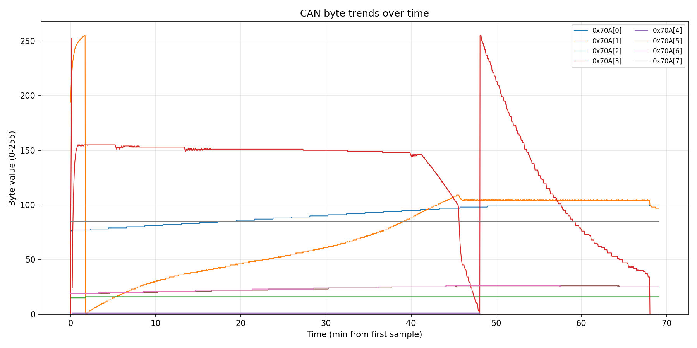
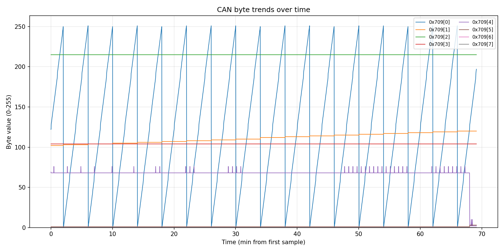
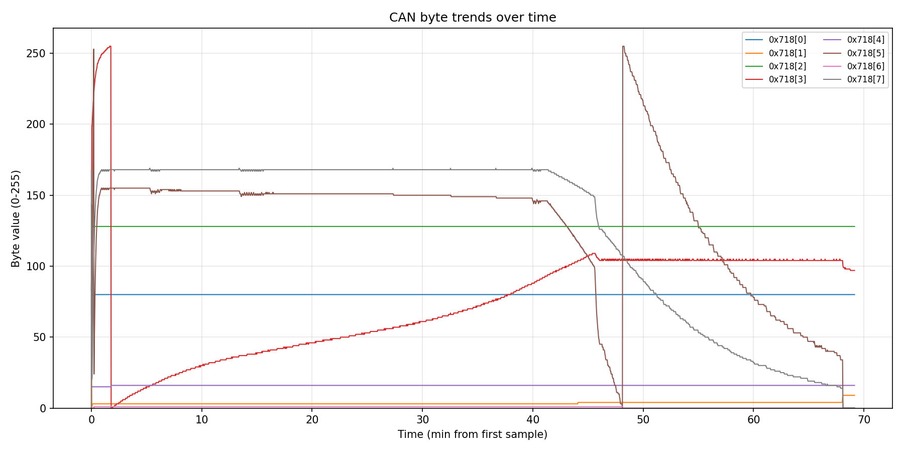

= Protocol Direct Battery Charging
:imagesdir: .

CAN frame analysis for direct charger <-> battery communication (no other e-bike systems involved).

== Session Context

* Topology: charger directly connected to battery.
* Initial battery indicator: around 60-80% (4th bar blinking at start).
* Observation: CAN communication starts when charger is connected.
* Hypothesis: a dedicated activation pin may wake/enable the battery CAN interface, so charger may not be strictly required to start communication.
* Capture file: `full_charge_cycle.jsonl`

=== Measurement topology (2-channel router)

Some captures use **two USB–CAN adapters** — one on the **battery** harness, one on the **charger** harness — with the repo’s **Python router** forwarding each received frame onto the other bus.

* **`origin` in the JSONL** means: this frame was **received on that segment’s adapter**, so it **entered the CAN bus from that side’s apparatus** (battery pack electronics vs charger), not a guess from the numeric CAN ID alone.
* After logging, the router **re-sends** the frame to the opposite segment so both sides stay linked.

Do **not** read the log as “the same ID proves request/response on one wire.” The audit trail is: **which apparatus produced traffic on its local bus**; the protocol may still use **overlapping ID values** on the two segments for different roles (poll vs reply), but **source** is known from **which adapter saw the frame first** (before the other side sees a forwarded copy).

Single-adapter captures (`full_charge_cycle.jsonl`) see the superposition on one bus; two-adapter captures (`capture.jsonl` with `--name-a` / `--name-b`) separate sides explicitly.

=== Battery Connector

[source,text]
----
|^|   [  ?  ][  ?  ][  ?  ]   |^|   |^|
| |                           | |   | |
| |   [  ?  ][  ?  ][  ?  ]   | |   | |
| |                           | |   | |
|_|   [  ?  ][CAN_H][CAN_L]   |_|   |_|
----

Connector photos:

image::jerry_rig_setup_charger_battery_sniffer_01.jpg[Jerry-rigged charger-battery-sniffer setup photo 1]
image::jerry_rig_setup_charger_battery_sniffer_02.jpg[Jerry-rigged charger-battery-sniffer setup photo 2]

=== Capture Command

pass:[<medium><strong>Helper to find the USB-CAN serial device on macOS:</strong></medium>]
pass:[<medium><code>ls /dev/tty.*</code></medium>]

[source,bash]
----
uv run sniffer run \
  --channels 1 \
  --device-a /dev/tty.usbserial-1310 \
  --output jsonl \
  --output-path full_charge_cycle.jsonl
----

== Confirmed Traffic Patterns

=== Startup/Broadcast

ID `0x718` appears immediately with payloads:

* `42 54 59 00 00 00 00 00` (`BTY.....`)
* `50 57 52 68 10 90 01 A8` (`PWRh....`)

=== Repeating Charge Dialogue

Observed request/response-like sequence:

* `0x709` `dlc=0` then `0x709` `dlc=8`
* `0x714` `dlc=0` then `0x714` `dlc=4`
* `0x715` `dlc=0` then `0x715` `dlc=4`
* `0x70A` `dlc=0` then `0x70A` `dlc=8`
* periodic `0x718` `dlc=8`

Interpretation (single-bus capture): alternating `dlc=0` then data on a given ID looks like **RTR-like polls** and **data replies** for that ID.

=== Refined interpretation (`two adapters + origin`)

With **one dongle on the charger branch** and **one on the battery branch**, the log ties each row to an **apparatus** (`origin=charger` vs `origin=battery`), independent of whether the protocol reuses a given numeric ID for different message types.

Observed roles (from `capture.jsonl`):

* **Charger apparatus** emits **`dlc=0`** polls on `0x709`, `0x714`, `0x715`, `0x70A` (RTR-like in behavior).
* **Battery apparatus** emits **data** on those same **identifier values** a few milliseconds later (`dlc` **8**, **4**, **4**, **8** respectively) — reply **payload shape** is what matters for decoding; **who spoke** comes from **`origin`**, not from matching IDs.
* **`0x718`**: **charger** side contributes most **8-byte data** frames in that session; **battery** may send a **one-shot** such as `42 54 59…` (`BTY`) at startup. Single-bus logs looked “emitter uncertain” because both directions share one observation point.

**Battery reply payload shape** (paired in time with charger polls in `capture.jsonl`; operational truth for “what the bus accepted”, not charger source code):

[cols="1,1,2,3",options="header"]
|===
| ID | Reply DLC | Stability (that session) | Notes

| `0x709` | 8 | `b[2]=0xFF`, `b[3]=0x68`, `b[6..7]=0` always | `b[0]` behaves as a rolling counter/time byte (aligns with earlier `0x709[0]` hypothesis). `b[1]` often `0x55` (`U`). `b[4..5]` small mode/status field.
| `0x714` | 4 | All replies identical: `68 10 58 02` | Treat as fixed register / ID block unless firmware update or other battery.
| `0x715` | 4 | All replies identical: `6C 07 19 00` | Same as `0x714`.
| `0x70A` | 8 | `b[7]=0x55` always | Matches “reference/checksum-like” idea for `0x70A[7]`. Other bytes carry telemetry (SOC/voltage/current candidates per table below).
|===

== Plot Commands and Artifacts

=== 0x70A

Emitter hypothesis: Battery

[source,bash]
----
uv run sniffer plot \
  --input-path full_charge_cycle.jsonl \
  --can-ids 0x70A \
  --byte-indexes 0,1,2,3,4,5,6,7 \
  --output-path end_phase_0x70A.png
----

Byte candidates:

[cols="1,3,3,1",options="header"]
|===
| Byte | Likely meaning | Proposed scaling | Confidence

| `0x70A[0]` | SOC candidate | `SOC% ~= b0` (to validate) | medium
| `0x70A[1]` | Pack voltage candidate | `Vpack ~= b1 * 0.4V` (to validate) | medium
| `0x70A[2]` | Temperature/status analog | unknown | low
| `0x70A[3]` | Charge current candidate | `Ichg ~= b3 * 0.0368A` (to validate) | medium
| `0x70A[4]` | State/flag/substate | unknown | low
| `0x70A[5]` | Temperature/limit/stage | unknown | low
| `0x70A[6]` | Temperature/state/balancing | unknown | low
| `0x70A[7]` | Fixed trailer (`0x55` in long paired capture) | — | high (session)
|===

=== 0x709

Emitter hypothesis: Battery

[source,bash]
----
uv run sniffer plot \
  --input-path full_charge_cycle.jsonl \
  --can-ids 0x709 \
  --byte-indexes 0,1,2,3,4,5,6,7 \
  --output-path end_phase_0x709.png
----

Byte candidates:

[cols="1,3,3,1",options="header"]
|===
| Byte | Likely meaning | Proposed scaling | Confidence

| `0x709[0]` | Rolling counter / timer-like byte | `counter = b0 (mod 256)` | high
| `0x709[1]` | State/status byte | unknown | low
| `0x709[2]` | Constant in paired captures (`0xFF`) | — | high (session)
| `0x709[3]` | Constant in paired captures (`0x68`, ASCII `h`) | — | high (session)
| `0x709[4]` | Mode/state selector candidate | unknown | low
| `0x709[5]` | Sub-state (often `0x01`) | unknown | medium
| `0x709[6]` | Reserved/constant (`0x00` in paired capture) | — | high (session)
| `0x709[7]` | Reserved/constant (`0x00` in paired capture) | — | high (session)
|===

=== 0x718

Emitter hypothesis: **Mixed** — with `origin` tagging, **charger** drives periodic `0x718` **data** frames; **battery** may send startup identifiers (`BTY`, etc.). Single-bus logs looked “uncertain” because both sides use the same ID.

[source,bash]
----
uv run sniffer plot \
  --input-path full_charge_cycle.jsonl \
  --can-ids 0x718 \
  --byte-indexes 0,1,2,3,4,5,6,7 \
  --output-path end_phase_0x718.png
----

Byte candidates:

[cols="1,3,3,1",options="header"]
|===
| Byte | Likely meaning | Proposed scaling | Confidence

| `0x718[0]` | Status/SOC-ish/mode constant | unknown | low
| `0x718[1]` | Flag/small state counter | unknown | low
| `0x718[2]` | Fixed reference/offset/status | unknown | low-medium
| `0x718[3]` | Charge voltage or voltage request | unknown | medium-high
| `0x718[4]` | Temperature or minor analog | unknown | low
| `0x718[5]` | Charge current or current limit | unknown | high
| `0x718[6]` | Flag/fault/enable | unknown | low
| `0x718[7]` | Current/taper variable/checksum-like | unknown | high
|===

== Mock reproduction (protocol summary)

This section collects what is **known well enough** to **simulate** charger and/or battery behavior on CAN for bench testing. It merges `capture.jsonl` (2-channel, `origin`-tagged), `full_charge_cycle.jsonl`, and the byte hypotheses above. **Unknowns** are called out so you can stub or log them.

=== Physical and CAN parameters

* **Bitrate:** `250000` bit/s (matches project sniffer default; confirm on your hardware if the link fails).
* **Frame format:** standard CAN **11-bit IDs** in observed traffic (extended not seen in these captures).
* **Topology for development:** two CAN segments with a **router** (or one bus with two nodes) — your mock must either **bridge** like the Python router or attach as **one end** of a real charger/battery link.

=== Actors

* **Charger (mock):** emits **remote-style polls** (`dlc=0` / RTR-equivalent) on four IDs, and **periodic data** on `0x718`. Drives the **poll cadence**.
* **Battery (mock):** responds to each poll with **data** on the **same ID** (per protocol), and may emit **startup** `0x718` once (e.g. `BTY`).

=== Identifier catalog (behavioral)

[cols="1,2,3,2",options="header"]
|===
| CAN ID | Typical source (physical) | Role | Reply / follow-up

| `0x709` | Charger polls → Battery answers | **Status / time / mode block** | Battery: **8** data bytes.
| `0x714` | Charger polls → Battery answers | **Fixed register** (ID/capability) | Battery: **4** bytes, constant in session (`68 10 58 02`).
| `0x715` | Charger polls → Battery answers | **Fixed register** | Battery: **4** bytes, constant in session (`6C 07 19 00`).
| `0x70A` | Charger polls → Battery answers | **Telemetry** (SOC/V/I candidates) | Battery: **8** bytes; **`b[7]=0x55`** invariant in long capture.
| `0x718` | **Both** (different roles) | **Startup + charger commands** | Battery may send `42 54 59 00 00 00 00 00` (`BTY.....`) once; charger sends many **8-byte** frames (e.g. `50 57 52 68…` `PWRh` pattern). Not part of the four-ID poll loop.
|===

=== Charger mock — minimal behavior

. On link up (optional): send **one** `0x718` **data** frame if mimicking charger startup (see observed `PWRh`-style payloads in captures).
. **Loop** (repeat forever, ~0.5–1 Hz per *individual* poll ID over a long capture; **burst** timing in logs is often ~100 ms between steps in the **709 → 714 → 715 → 70A** sequence — **measure** on your bus):
.. Emit **poll** on `0x709`: **DLC 0** (empty payload; use true **RTR** if your stack supports it so receivers honor requested length).
.. Wait for **battery reply** on `0x709` (8 bytes) *or* short timeout (real charger may retry — not characterized here).
.. Same for `0x714`, `0x715`, `0x70A` in order: **poll DLC 0**, expect **4 / 4 / 8** byte responses respectively.
. **Separately**, emit **periodic `0x718` data** (8 bytes) at the rate seen in logs (roughly coarser than each single poll; correlate with `0x70A` in traces if you need realism).

**Charger poll shape:** logged as `dlc=0`; if your API distinguishes **RTR** from **data**, prefer **RTR** with **requested DLC** matching the expected response length (**8** for `0x709`/`0x70A`, **4** for `0x714`/`0x715`) — classic CAN uses the RTR DLC field that way (verify with your CAN stack).

=== Battery mock — minimal behavior

. After power/enable, optionally send **one** `0x718` **data** frame: `4254590000000000` (`BTY.....`) to mimic startup identification.
. For **each** incoming **poll** (DLC 0 / RTR) on `0x709`, respond with **8 bytes** on **`0x709`** within a few milliseconds (target **< 10 ms** if emulating observed delay).
. Same pattern:
* `0x714` → reply **4** bytes: `68105802` (until you have evidence of variation).
* `0x715` → reply **4** bytes: `6C071900`.
* `0x70A` → reply **8** bytes; keep **`b[7]=0x55`**; fill `b[0..6]` with plausible ramping values (see plot scalings for SOC/V/I experiments).

**`0x709` battery template** (from paired captures — **dynamic** bytes must evolve for a believable session):

* **Constant:** `b[2]=0xFF`, `b[3]=0x68`, `b[6]=0x00`, `b[7]=0x00`.
* **Vary:** `b[0]` — counter/timer-like (increment or time-derived); `b[1]` often `0x55`; `b[4]`, `b[5]` — small mode/state (e.g. `44 01`, `45 01` patterns in logs).

=== Timing (order of magnitude)

* **Poll-to-reply delay:** ~**3–30 ms** between charger poll and battery data on same ID in `capture.jsonl` (typical ~**7 ms**).
* **Full four-ID sweep:** appears on the order of **~100 ms** between successive poll types in tight sequences; **long-term** average spacing is dominated by idle/gaps — **do not** rely on a single global period without measuring your target hardware.

=== What a mock can leave unknown (stubs)

* **Exact** `0x718` charger payload encoding (V/I setpoints, mirrors of `0x70A`, checksums).
* **Validation rules** inside charger firmware (illegal `0x709` sequences, fault if `0x714` wrong).
* **RTR vs zero-length data frame** — if the partner is picky, use hardware/Stack that sends **proper RTR** with correct **DLC**.
* **Activation pin / wake** (hypothesis in Session Context) — mock may need **real** battery enable or a **simulated** enable line if the pack refuses CAN until awake.

=== Router caveat (if you use the repo bridge)

The Python router **forwards** every received frame to the other bus. A **double mock** (charger mock + battery mock) on both sides of the router must **not** create **feedback loops** (e.g. forwarding a forwarded frame forever). The real sniffer’s router **skips** `is_tx` echoes; your simulation should mirror that discipline or connect **one** mock to **one** real device.

== Planned Validation Cycles

* Heat battery scenario to observe failing-charge behavior.
* Heat charger scenario to observe failing-charge behavior.