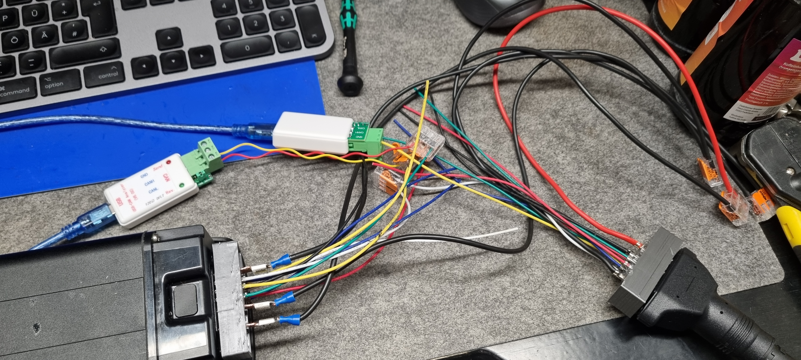
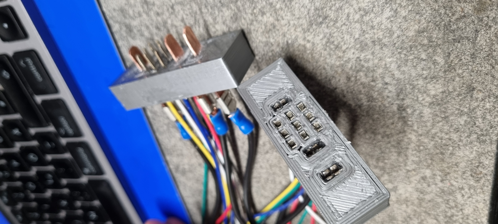
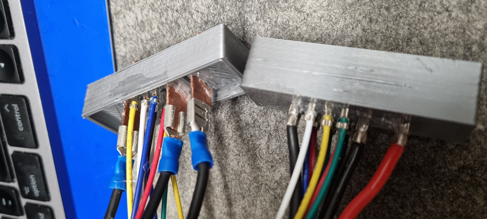
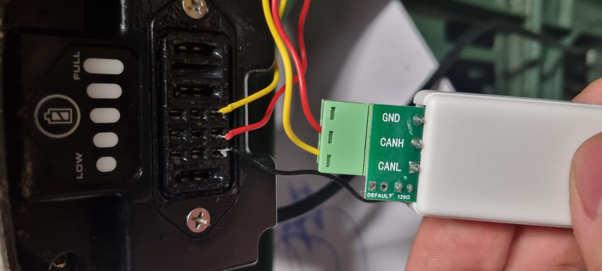
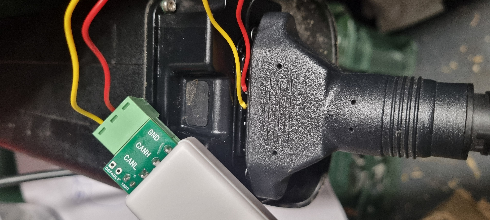

# Shimano STEPS CAN Analysis Data

This repository stores captured CAN datasets and reverse-engineering analysis artifacts for Shimano STEPS systems.

## Goal

The goal is to build a structured, reproducible analysis base for Shimano CAN communication:

- Keep raw capture data and derived plots together.
- Track protocol hypotheses and validation notes over time.
- Separate analyses by component or subsystem for clarity.

## Structure

- `DarfonBatteryChargerCommunicationAnalysis/`: charger <-> battery communication captures, plots, and findings.

Additional component analyses can be added as new top-level folders following the same pattern.

## EP8 battery connector (hardware)

Tapping the battery’s CAN and power lines needs a mating connector for the Shimano STEPS EP8 pack. A **3D-printable model** that fits the EP8 battery interface is available here:

- [Shimano STEPS EP8 battery connector — Printables](https://www.printables.com/model/1658582-shimano-steps-ep8-battery-connector)

Print the shell, add blades/contacts and wiring per your build, then use it with USB–CAN adapters (and optional charger-side harness) like in the photos below.

### Setup and connector photos

**Full bench setup** — EP8 battery on the printed breakout, dual USB–CAN adapters on the harness, Wago-style splices, and the round charger/bike harness connector in the loop:

**Connector halves** — mating faces: power blades and the signal/socket side of the printed housing:

**Wiring detail** — internal terminations (thick red/black power, thinner signal wires):

**Earlier jerry-rig sessions** (same project, different angles):

## Related Tooling

Sniffing and routing are performed with the companion repository:

- [multican-sniffer-bridge](https://github.com/CapnDeCode/multican-sniffer-bridge)

Use that project to record traffic and generate artifacts that are then stored here for long-term analysis.
